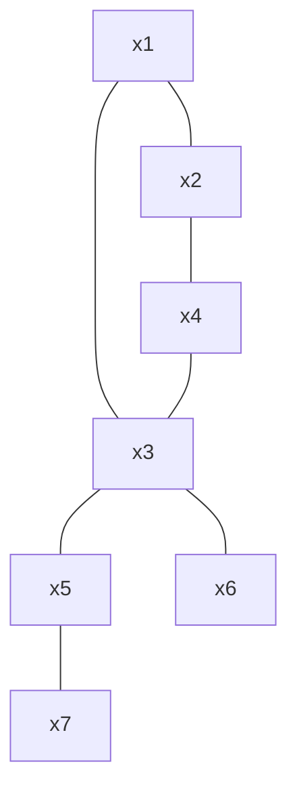
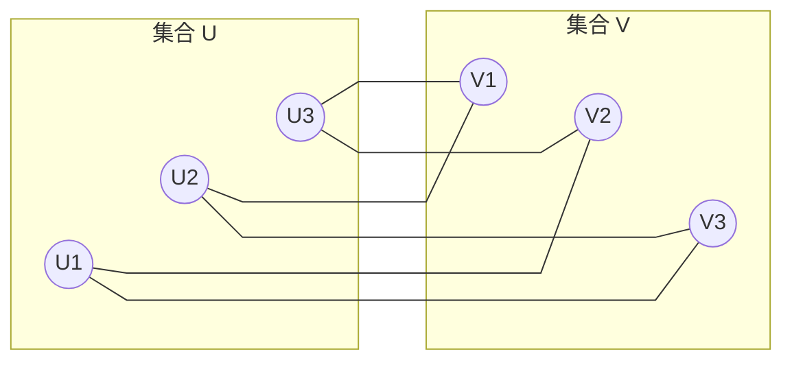
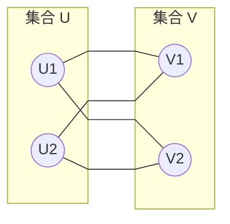
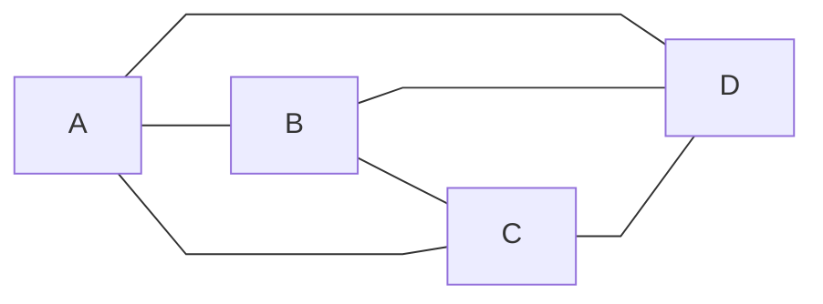

与数论类似，都是笨人没好好学过的东西，同样主要内容来自 $ mit $ 的离散数学课程以及 $ Gemini $ 。

<!-- more -->

# 引入
尽管有点神秘，但如果我们希望研究男女之间的关系，图论是个很好的工具。
你认为男性和女性拥有的伴侣数量哪个多？
据课程提到的调查而言，$ US $ 的调查结果是男性比女性高 $ 73\%$，而根据 $ BBC $ 的神秘调查，男性比女性高 $ 233\%$，每个男性平均 $ 20 $ 个，女性 $ 6 $ 个。~~（为什么我 $ 0 $ 个）~~
在研究之前，先来点数学基础。
# 图的定义
图是集合 $(V,E)$ 的组合(a pair of sets)。其中 $ V $ 是非空的顶点（节点）的集合，$ E $ 是 $ V $ 中顶点对组成的集合，一对 $ E $ 中的顶点称为边。

称节点 $ A,B $ **相邻**如果他们之间有一条边。
称一条边与其两个端点**关联**。
称一个顶点的**度(degree)** 为与其关联的边的数量
称一个图是简单的，如果它没有环或者重边。环指两个端点相同的边，重边指某两个点之间存在大于一条边。

图和伴侣有什么联系呢，已经昭然若揭了。我们可以用顶点表示人，通过是否有边来表示两人是否有伴侣关系。一个人的度也就表示了他的伴侣数量。
那么我们可以定义平均节点数来表征平均伴侣个数。
设男性节点集合为 $ V_M $，女性节点集合为 $ V_W $。定义 $ A_M,A_W $ 表示平均度数。

$$
A_M=\frac{\sum\limits_{n\in V_M}deg(n)}{|V_M|}=\frac{|E|}{|V_M|}
$$

我们假定没有同性恋，那么度的求和就等于边数求和。同样的，我们有

$$
A_W=\frac{\sum\limits_{n\in V_W}deg(n)}{|V_W|}=\frac{|E|}{|V_W|}
$$

也就是说，男女伴侣平均数量之比实际上也就是：

$$
\frac{A_M}{A_W}=\frac{|V_W|}{|V_M|}
$$

我们并没有为了解决问题做什么奇怪的简化（不像真空球形鸡），这个结果是精确的，所以那些神秘的调查……不知道在干什么。还有类似的调查，指出波士顿的校园里少数族裔倾向与非少数族裔一起学习（
因为他们人少啊。
不幸的是以上就是所有有关男女关系的讨论了（
看来图论并不能帮人脱单？

# 图着色问题
尽管教务实际上如何安排考试暂时不能给你明确的答复，但是可以理想地抽象成一个图论问题。把课程变为顶点，如果有重复的学生就存在边。如何安排考试使得学生们的考试不会冲突？
### 图着色问题
给定一个图 $ G $ 和 $ K $ 种颜色，给每个节点上色使得相邻的节点颜色不同。
### 图的色数(chromatic number)
上述 $ K $ 的最小值。记为 $\chi(G)$。

时间段就对应了颜色，$ G $ 代表了课程们。那么图着色也就成了排考试的问题。

### 基本图着色算法（贪心）
#### 1.排序
将节点排序 $ V_1,...V_n $
#### 2.将颜色排序
将颜色排序 $ C_1,...,C_n $
#### 3.上色
依次上色，给 $ V_i $ 填上最小编号合法颜色。
#### 定理
如果每个节点的度数都不超过 $ d $，那么这个算法至多使用 $ d+1 $ 种颜色就能完成上色。

>[!证明]
>利用归纳法证明。
>据说不少 $ MIT $ 的学生在考试中将 $ d $ 换成 $ n $ 来试图归纳。似乎确实很诱惑。$ n=0,1 $ 显然成立，然后考虑从 $ n $ 到 $ n+1 $，怎么办呢，不太能把最大度数 $ n+1 $ 的图降成 $ n $ 的图。
>可行的做法是，对节点数归纳，在图中这是比较常见的操作，如果节点数还不行，还可以加上边。
>
>**归纳假设**：假设对于所有节点数 $ n = k $ 且最大度数不超过 $ d $ 的图，该算法都能用不超过 $ d+1 $ 种颜色完成着色。这对 $ n=1,2 $ 显然成立。
>
>**归纳递推** 现在考虑一个有 $ n = k+1 $ 个节点的图 $ G $。我们从图 $ G $ 中任意去掉一个顶点 $ v $ 以及与之相连的边。剩下的子图 $ G'$ 拥有 $ k $ 个节点。
>
>**应用假设** 由于在原图中每个节点的度数都不超过 $ d $，去掉 $ v $ 后，子图 $ G'$ 的最大度数依然不会超过 $ d $。根据**归纳假设**，$ G'$ 可以用 $ d+1 $ 种颜色完成合法着色。
>
>**回填顶点 $ v $** ，现在我们将顶点 $ v $ 放回图中。此时我们需要给 $ v $ 上色。在原图中，$ v $ 的度数 $\text{deg}(v) \leq d $。这意味着 $ v $ 最多只有 $ d $ 个邻居。即便这 $ d $ 个邻居在第二步中被染成了 $ d $ 不同的颜色，由于我们总共有 $ d+1 $ 种颜色可用，一定至少剩下一中颜色没有被 $ v $ 的邻居使用。我们将剩下的那一种颜色分配给 $ v $。此时，$ v $ 与其邻居颜色均不相同，着色依然合法。
>
>**结论：** 由数学归纳法可知，对于任意 $ n $，只要最大度数不超过 $ d $，贪心算法至多使用 $ d+1 $ 种颜色即可完成着色。**证毕。**

这给出了贪心的一个上界。实际上他可能做的更好，例如一个辐射状的图，只需要 $ 2 $ 种颜色。这个算法的好坏与排序关系很大，例如考虑这样一个图：

这样可以分成两个集合，边总是从一个集合连到另一个集合的图叫做二部图。可以自行尝试，会发现排序会很大地影响上的颜色种类。

# 匹配算法
在情侣之后，便是更为庄重的婚姻了，而婚姻实际上是一个匹配问题（
**定义**：给定一个图 $ G=(V,E)$，一个匹配是指一个 $ G $ 的子图，其中每个节点的度数为 $ 1 $ 。~~（一夫一妻制）~~
若每个节点都匹配，称这个匹配是完美匹配。
有时候我们会碰到加权图，每条边都有自己的权重。**定义**一个匹配的**权重**为其所有边权重的和。从而自然也就有了**最小权重完美匹配**。
有时候权重并不对称，正如喜欢未必是相互的。$ W_{ij} \neq W_{ji}$ 是很常见的事（

例如，U1和V2互相是对方的第一顺位，但U2却把V2看做第一顺位，V1把U1看做第一顺位。~~好复杂~~ 

**定义** 如果在当前的匹配方案中，一对成员互相更看好对方，而不是目前分配给他们的对象，那么他们是一对不稳定对。在大家反应之前，他们会偷偷离开并讨论离散数学到深夜（

**定义** 如果没有不稳定对，那么我们说这是一个稳定的匹配。

如果我们希望稳定，那么这里我们可以让U1和V2配队，尽管不是每个人都很幸福，但至少这样稳定(?)
但现实情况往往复杂得多，也许未必存在稳定的匹配。在比较糟糕的情况下（数学上的糟糕），可能关系并不是一个二部图（

按照 $ ABC $ 的顺序依次为第一顺位，逆向则依次第二顺位，$ D $ 总是第三顺位（
这种情形下，**不可能存在稳定匹配**。

>[!证明]
>利用反证法。假设存在稳定匹配，不失一般性，可以设AD匹配，那么因为C更喜欢A，A更喜欢C，就有一对不稳定对。

## 婚姻稳定问题
假设有 $ N $ 个男孩，$ N $ 个女孩。每个人都有自己的偏好排序。能否找到一个稳定的匹配？

贪心是一个简单的办法，效果如何呢？随便编一点数据试试就知道这很容易分配出不稳定对。并不妙。

**约会算法(TMA)**
每个早上，女孩会站在他们的阳台上，每个男孩都去仍在他们喜欢名单中的最喜欢的女孩的阳台下唱小夜曲。在下午女孩至少有一个求婚者，她会选择她最喜欢的那一个，告诉他也许他们会结婚，希望他明天再来，这样不会让她显得太轻浮。然后她拒绝其他低优先级的男孩，这些可怜的男孩会把这个女孩从名单上删去。如此重复直到所有女孩只有一个求婚者。如此，不会有女孩嫁不出去，也不会有男生被所有女生拒绝，只能呆在家里写他的离散数学作业，也不会有不稳定对。

我们会证明

- 这个过程会在有限步终止，男孩不会一直唱小夜曲

- 每个人都会结婚

- 不会有不稳定对。

>[!证明会较快地结束]
>利用反证法。假设终止时间晚于 $ N^2+1 $ 天。
>如果没有终止，那么一定至少有一个男孩从名单上划去了一个女孩（被拒绝了www）。那么 $ N^2+1 $ 天之后会划去 $ N^2+1 $ 个女孩。但名单中总共只有 $ N^2 $ 个女孩。这产生了矛盾。
>从而必须终止于 $ N^2+1 $ 及之前。

>[!证明每个人都会结婚]
>让 $ P=$"如果一个女孩 $ G $ 拒绝了男孩 $ B $，那么 $ G $ 的伴偶一定不比 $ B $ 差。"
> $ Lemma $ $ 1 $ ：$ P $ 是过程中的不变量。
> 证明：一开始，没人被拒绝，所以正确。假设在 $ d $ 时刻成立，$ d+1 $ 时刻如果 $ G $ 拒绝了 $ B $，根据流程 $ P $ 当然成立。如果 $ G $ 在这之前拒绝了 $ B $ ，那么利用假设，$ G $ 在第 $ d $ 天有一个比 $ B $ 更好的选择，这当然让 $ P $ 成立。
>
> 使用反证法
> 假设结束的时候 $ B $ 还没结婚，说明他被所有人拒绝了。根据 $ Lemma $ $ 1 $ 这说明所有女孩都有比 $ B $ 更好的选择，这说明每个女孩都结婚了，从而每个男孩也都结婚了，矛盾。从而命题成立。

>[!证明不会有不稳定对]
>让 $ Bob $ 和 $ Gail $ 作为一对没有结婚的男女。下面证明他们不会是不稳定对。
>情况一：$ Gail $ 拒绝了 $ Bob $，说明 $ Gail $ 与她觉得比 $ Bob $ 好的男人结婚了。那么因为 $ Gail $ 更喜欢她的配偶，$ Gail $ 和 $ Bob $ 不会是不稳定对。
>情况二：$ Gail $ 没有拒绝 $ Bob $，那么 $ Bob $ 没有为 $ Gail $ 唱过小夜曲，那么 $ Bob $ 更喜欢他的配偶，所以他们也不会是不稳定对。
>上述涵盖了所有情况，从而不会有不稳定对。

让 $ S $ 为所有稳定匹配的集合。由于上述 $ TMA $ 算法会产生稳定解，$ S $ 非空。

对每个人 $ P $，定义一个集合 $ R $ 包含 $ S $ 中所有 $ P $ 可能的配偶。

**定义**一个人的最佳伴侣为 $ R $ 中 $ P $ 最喜欢的，最差伴侣为 $ R $ 中 $ P $ 最不喜欢的。那么我们将得到两个重磅定理：

- $ TMA $ 让每个男孩和他们的最佳伴侣配对。

- $ TMA $ 让每个女孩和她们的最差伴侣配对。

这两个定理揭示了博弈论中一个有趣的现象：**主动权带来最优性。**

>[!证明男孩得到最佳伴侣]
>假设存在至少一个男孩没有配对到最佳伴侣。设 $ B $ 是他们中第一个被 $ R $ 中(稳定)伴侣拒绝的。
>记他的最佳伴侣是 $ G $，根据算法，$ B $ 被 $ G $ 拒绝过，从而 $ G $ 有比 $ B $ 好的伴侣 $ B'$ 。
>那么根据假设，$ B'$ 没有被稳定伴侣拒绝过。从而要么 $ G $ 是 $ B'$ 的最佳伴侣，要么比他的最佳伴侣还好，即：在任何包含 $(B, G)$ 的稳定匹配 $ M $ 中，$ B'$ 都会更喜欢 $ G $（相比于 $ B'$ 在 $ M $ 中的配偶）。
> $ G $ 是 $ B $ 的稳定伴侣，$ G $ 更喜欢 $ B'$ ，$ B'$ 也更喜欢 $ G $，所以 $ G $ 和 $ B'$ 是一对不稳定对，矛盾。
> 从而没有男孩会被最佳伴侣拒绝。

>[!证明女孩得到最差伴侣]
>假设某个女孩得到的稳定匹配伴侣 $ B'$ 比 $ TMA $ 中的 $ B $ 差。设 $ B $ 在那稳定匹配中得到伴侣 $ G'$ ，根据刚证的定理，$ B $ 更喜欢 $ G $，而 $ G $ 也更喜欢 $ B $，从而 $ m $ 匹配有 $ B,G $ 这一对不稳定对，不稳定，矛盾。
>从而女孩得到的是最差伴侣。