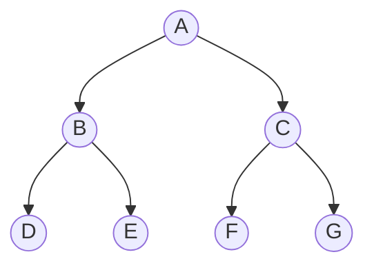
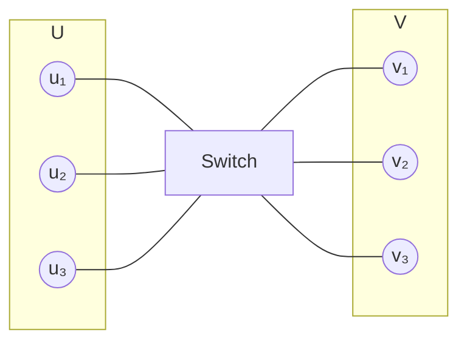
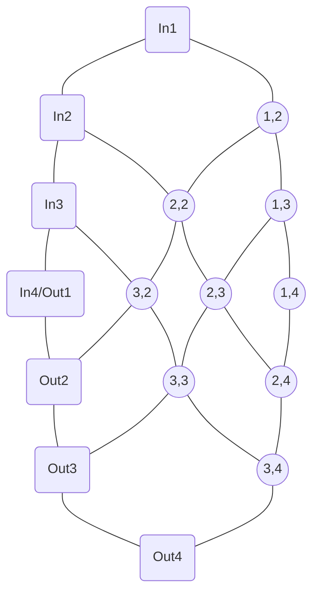
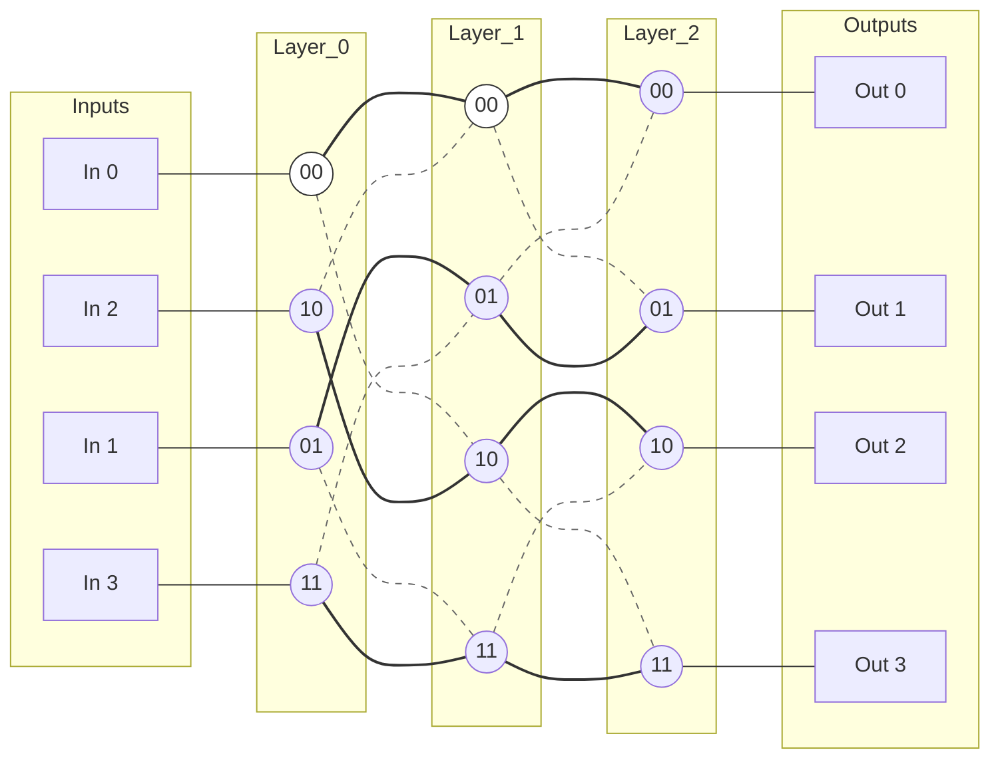
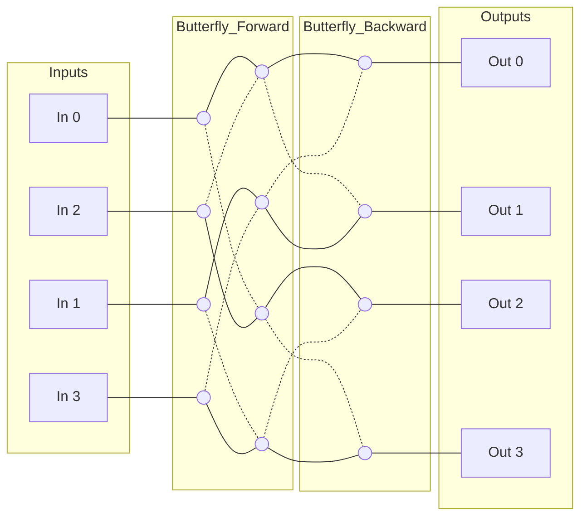

在分布式系统和多处理器计算机中，核心问题是如何高效地连接 $ N $ 个输入和 $ N $ 个输出。

<!-- more -->

### 1. 通信网络的四大衡量指标

设计一个网络拓扑 $ G $ 时，我们审视以下四个属性：

- 需要的交换机数量、大小
    
- **Degree (度数):** 每个节点引出的边数（受硬件物理接口数量限制，理想情况下应为常数）。
    
- **Diameter (直径):** 任意输入到输出的最短路径的最大长度（决定了信号传输的最大延迟）。
    
- **Congestion (拥塞度):** 在所有可能的“一对一”通信排列中，经过某条边的最大包数量（决定了网络的吞吐瓶颈）。
    
#### 排列
一个从 $ 1,...,n $ 到 $ 1,...,n $ 的函数，将 $ i $ 映射到 $\pi(i)$ ，$\pi(i)=n(j)$ 当且仅当 $ i=j $ 。

对于 $ N $ 个输入输出，从第 $ i $ 个输入到其对应输出的 $ path $ 记作 $ P_{i,\pi(i)}$ 。
**拥塞度** ：所有 $ P_{i,\pi(i)}$ 通过的最多的边被通过的次数的最大值。
例如，对二叉树，这个值可能是 $ 1 $(输入输出的父节点一样)，也可能是 $ N $(所有输入都要经过最顶上的节点才能到输出)，那么其拥塞度就是 $ N $ 。

---

### 2. 几种结构

#### 二叉树(Binary Tree)
底端是输入输出。

- **指标：** 直径 $= 2(1+log(N))$, 需要 $ 2N-1 $ 台交换机。
    
- **致命伤：** 拥塞度 $= N $ 。

####  完全二部图 (Complete Bipartite Network)

每个输入直接连向每个输出。

- **指标：** 直径 $= 1 $，拥塞度 $= 1 $。
    
- **致命伤：** 需要一台 $ N\times N $ 的交换机。
    

#### B. 二维网格 (2-D Mesh)

 $ N \times N $ 的阵列。

- **指标：** 度数 $= 4 $，需要 $ N^2 $ 台 $ 2\times 2 $ 的交换机  ，拥塞度 $=2 $ 。
    
- **缺点：** **直径 $= 2N $**。 
    

##### Theorem： 拥塞度=2

>[!证明]
>如此行走： $ P_{i,\pi(i)}$ 为从 $ row_i $ 向右走到 $ col_{\pi(i)}$，再向下走到输出。对于节点 $(i,\pi(i))$，它只可能从左或上方被经过，那么只可能来自 $ Ini $ 和到达 $ Out\pi(i)$ 的两种情况，故不超过 $ 2 $，显然有排列可以达到 $ 2 $ 。

#### 蝶形网络 (Butterfly Network)

为了解决延迟问题，我们引入了分层递归。一个 $ N=2^k $ 的蝶形网络由两部分 $ N/2 $ 的子网络组成。

- **结构：** 共有 $\log N + 1 $ 层，每层 $ N $ 个节点。
    
- **路由逻辑：** 节点地址为二进制。在第 $ i $ 层，比较目标地址的第 $ i $ 位：
    
    - 若为 0，走向左下方的子网络；
        
    - 若为 1，走向右下方的子网络。
        
- **指标：**
    
    - **Size:** $ N(\log N + 1)$
        
    - **Degree:** 4
        
    - **Diameter:** $ 2+\log N $（**巨大突破！** $ 10^6 $ 个节点，直径仅约 20）。
        
    - **Congestion:** $\approx \sqrt{N}$（在中间层会发生严重的“交通堵塞”）。
        

如果用二进制表示输入的编号，那么要达到输出，只要如此：如果这 $ bit $ 两个相同，则前行，否则跳到上一块或下一块蝴蝶状的小网络上。

#### Benes网络

由两个蝴蝶网络背靠背组成，其阻塞度为 $ 1 $ 。

>[!]
>考虑 $ N=2^a, a=1,2,3...$ 的情形，由于 $ Benes $ 网络去掉首尾列再保留上半部分仍然是一个 $ Benes $ 网络，可以运用归纳法证明。
>对 $ a=1 $ 的情形，简单枚举可知成立。
>归纳假设即命题，可将 $ a $ 的情形拆成 $ 2 $ 个 $ a-1 $ 的网络加上首尾的节点的情形，此时，只要较好地分配进入上下子网络的方式，就可以利用归纳假设得证。
>具体的，我们需要让子网络的输入端只接受一个信号，那么由于每个输入端都有两条指向他们的箭头，我们需要一种策略使得每个输入端只留下一个，输出同理。
>构造约束图，画出原图的输入端，把指向同一个子网络输入端的节点之间连线。
>节点：$ 0, 1, \dots, N-1 $。
>边类型 A（输入）：将指向同样子网络输入端连起来，表示它们必须去往不同子网络。 
>边类型 B（输出）：如果输入 $ i $ 的目的地是 $ j $，输入 $ i'$ 的目的地是 $ j'$，且 $ j, j'$ 属于同一个输出交换机，则将 $ i $ 和 $ i'$ 连起来。
>这个约束图 $ G'$ 中每个节点的度数恰好为 2（一条输入约束边，一条输出约束边）。
>

